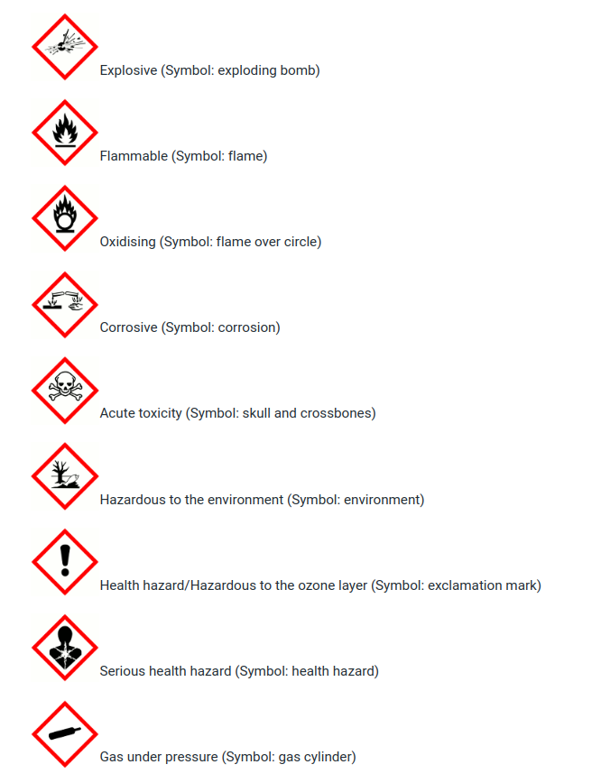

---
sidebar_custom_props:
    emoji: ☢️
additional_authors: Jon K
shortlinks:
  - coshh
---
# COSHH Cupboard

The law requires you to adequately control exposure to materials in the workplace that cause ill health - this is
referred to as [Control of Substances Hazardous to Health (COSHH)](https://www.hse.gov.uk/coshh/).

To comply with these regulations, we have a locked metal cabinet in the dock that stores hazardous materials
(flammables, chemicals, paints etc) alongside their datasheets. The contents of this is logged each month by the WAC
Head of Workshop.

<figure>

<figcaption>
Images before and after a COSHH cupboard cleanout. Note how the bottom shelf must be clear!
</figcaption>
</figure>

## Guidance

* The key to the COSHH cupboard is kept in a lockbox mounted on the wall to the right. The code for this can be obtained
  from Tech Crew exec if required.
* Everything in the COSHH cupboard should have a proper data listing content.
* The bottom of the cupboard is a drip tray and cannot have things stored there. It **must** be kept clear.
* A hazardous material will have a red diamond with a pictogram of the hazard inside.
* Safety is everyone’s responsibility.

## Stock

We stock the following items in the cupboard. If any stock is low, please inform Tech Crew Exec.

| Item                                         | Purpose/Notes                                                                                                                                                                                                                                                                                                                                                                                                                                                                                                                                                                         |
|----------------------------------------------|---------------------------------------------------------------------------------------------------------------------------------------------------------------------------------------------------------------------------------------------------------------------------------------------------------------------------------------------------------------------------------------------------------------------------------------------------------------------------------------------------------------------------------------------------------------------------------------|
| Air Duster                                   | For air dusting… and clearing out mics when sweated out.                                                                                                                                                                                                                                                                                                                                                                                                                                                                                                                              |
| Label Remover                                | Good for removing tape from mic cables and cleaning cables, need to soak.                                                                                                                                                                                                                                                                                                                                                                                                                                                                                                             |
| Isopropyl Alcohol (rubbing alcohol)          | Removing sharpie from case labels (this has an invisible flame).                                                                                                                                                                                                                                                                                                                                                                                                                                                                                                                      |
| Paints                                       | Tech Crew stock white and black coats, other paints are bought for shows specifically and should be labelled with which show and dates of purchase. Where possible, water-based, non-aerosolised paints should be chosen. When mixed, some paints will never dry – ask before you buy if unsure. Some paints are designed to be watered down – again, ask if unsure. White paint is often used as an undercoat, with the final colour being applied as a second layer. If you mix colours, remember to keep track of what ratio you used, in case you need more of that colour later! |
| N5 Flamebar                                  | Used for wood and wood products (paper, cardboard, etc.).                                                                                                                                                                                                                                                                                                                                                                                                                                                                                                                             |
| PE6 Flamebar                                 | Used for natural and synthetic materials (cotton, linen, muslin, wool, etc.).                                                                                                                                                                                                                                                                                                                                                                                                                                                                                                         |
| Flamebar flame retardants application        | Can be applied by dipping, spraying, padding, or brushing. Use the solution as supplied or dilute with water according to data sheet or preferably by test. Flame retardancy is long-lasting, but if you wash what you flamebared, you should reapply another layer.                                                                                                                                                                                                                                                                                                                  |
| Paint Brushes, Rollers, Trays, Spray Bottles | Tech Crew stock of painting and Flamebar supplies. The contents are for everyone to use, so clean them once you’re finished. If there are issues, contact Tech Crew Exec.                                                                                                                                                                                                                                                                                                                                                                                                             |

Please note that the consumables in the COSHH cupboard are not free. Some contents of the cupboard might be for other
shows, so check with Tech Crew Exec before you use something that’s already in there (and label what is for your show).
We don’t make profit on consumables; the cost is passed onto the show as transparently as we can.

## [Hazard Pictograms (symbols)](https://www.hse.gov.uk/chemical-classification/labelling-packaging/hazard-symbols-hazard-pictograms.htm)

